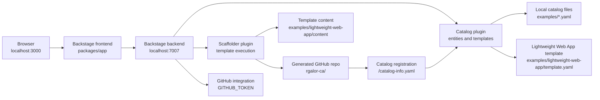

# Frontier Developer Platform Technical Documentation

## 1. Purpose And Scope

This repository contains the Frontier Developer Platform, a local Backstage developer portal plus a custom Software Template named `Lightweight Web App`.

The portal is intended to:

- Run Backstage locally on Windows with Node.js 22 or 24.
- Provide a Backstage catalog and scaffolder UI at `http://localhost:3000`.
- Publish generated static web app repositories to GitHub.
- Register generated repositories back into the Backstage catalog through `catalog-info.yaml`.
- Keep the generated app starter intentionally small: HTML, CSS, JavaScript, and a tiny Node.js preview server.

This document describes the actual implementation in this repository. It is not a generic Backstage tutorial.

## 2. High-Level Architecture



Runtime responsibilities:

- `packages/app` renders the Backstage frontend and navigation.
- `packages/backend` runs the Backstage backend plugins.
- `app-config.yaml` wires runtime config, catalog locations, GitHub integration, auth, TechDocs, search, and permissions.
- `examples/lightweight-web-app/template.yaml` defines the scaffolder template.
- `examples/lightweight-web-app/content` contains the files copied into generated GitHub repositories.

## 3. Repository Layout

Important paths:

```text
backstage-lightweight/
  app-config.yaml
  app-config.production.yaml
  package.json
  README.md
  docs/
    technical-documentation.md
  packages/
    app/
      src/App.tsx
      src/modules/nav/Sidebar.tsx
      public/
    backend/
      src/index.ts
      Dockerfile
  examples/
    entities.yaml
    org.yaml
    template/
      template.yaml
      content/
    lightweight-web-app/
      template.yaml
      content/
        app.js
        catalog-info.yaml
        index.html
        package.json
        README.md
        server.js
        styles.css
```

The repository uses Yarn 4 through the pinned local binary:

```text
.yarn/releases/yarn-4.4.1.cjs
```

Use the pinned binary because global `yarn` may not be installed and Corepack may not have permission to write into `C:\Program Files\nodejs`.

## 4. Runtime Components

### 4.1 Frontend

Frontend entry points:

- `packages/app/src/index.tsx`
- `packages/app/src/App.tsx`
- `packages/app/src/modules/nav/Sidebar.tsx`

`App.tsx` creates the app with:

```ts
createApp({
  features: [catalogPlugin, navModule],
});
```

The generated Backstage frontend still discovers enabled packages from `app-config.yaml` through:

```yaml
app:
  packages: all
```

The custom sidebar manually renders navigation items and suppresses duplicated default nav entries through `app-config.yaml`:

```yaml
app:
  extensions:
    - nav-item:search: false
    - nav-item:user-settings: false
    - nav-item:catalog: false
    - nav-item:scaffolder: false
```

The catalog page is mounted as the root route:

```yaml
- page:catalog:
    config:
      path: /
```

### 4.2 Backend

Backend entry point:

```text
packages/backend/src/index.ts
```

The backend uses Backstage's new backend system:

```ts
const backend = createBackend();
```

Loaded backend plugins:

| Plugin | Purpose |
| --- | --- |
| `@backstage/plugin-app-backend` | Serves frontend assets in production-style backend mode. |
| `@backstage/plugin-proxy-backend` | Provides backend proxy support for configured endpoints. |
| `@backstage/plugin-scaffolder-backend` | Executes Software Templates. |
| `@backstage/plugin-scaffolder-backend-module-github` | Adds GitHub publish and repository actions. |
| `@backstage/plugin-scaffolder-backend-module-notifications` | Enables notification actions from templates. |
| `@backstage/plugin-techdocs-backend` | Enables TechDocs backend features. |
| `@backstage/plugin-auth-backend` | Provides auth service APIs. |
| `@backstage/plugin-auth-backend-module-guest-provider` | Allows local Guest sign-in. |
| `@backstage/plugin-catalog-backend` | Stores and serves catalog entities. |
| `@backstage/plugin-catalog-backend-module-scaffolder-entity-model` | Enables Template entity processing. |
| `@backstage/plugin-catalog-backend-module-logs` | Logs catalog processing errors. |
| `@backstage/plugin-permission-backend` | Runs the permission framework. |
| `@backstage/plugin-permission-backend-module-allow-all-policy` | Permissive local development policy. |
| `@backstage/plugin-search-backend` | Provides search backend. |
| `@backstage/plugin-search-backend-module-pg` | Postgres search engine module. Skips itself when Postgres is not configured. |
| `@backstage/plugin-search-backend-module-catalog` | Indexes catalog entities. |
| `@backstage/plugin-search-backend-module-techdocs` | Indexes TechDocs documents. |
| `@backstage/plugin-kubernetes-backend` | Kubernetes plugin backend. Warns locally when no Kubernetes config exists. |
| `@backstage/plugin-notifications-backend` | Notification storage and APIs. |
| `@backstage/plugin-signals-backend` | Signal/WebSocket support. |
| `@backstage/plugin-mcp-actions-backend` | Exposes configured Backstage actions for MCP-style action access. |

## 5. Configuration Model

Primary config file:

```text
app-config.yaml
```

Production config file:

```text
app-config.production.yaml
```

### 5.1 App URLs

```yaml
app:
  title: Frontier Developer Platform
  baseUrl: http://localhost:3000

backend:
  baseUrl: http://localhost:7007
  listen:
    port: 7007
```

The default development topology is:

- Frontend dev server: `http://localhost:3000`
- Backend API server: `http://localhost:7007`

### 5.2 Local Database

```yaml
backend:
  database:
    client: better-sqlite3
    connection: ':memory:'
```

This is a local development database. Because it is in-memory, data that is not backed by static catalog locations can disappear on backend restart.

The local template and example catalog data are file-backed through `catalog.locations`, so Backstage can re-ingest them after restart.

### 5.3 Auth

```yaml
auth:
  providers:
    guest: {}
```

The portal currently uses Guest auth. This is convenient for local development but is not suitable for production authorization or audit requirements.

Guest user identity is typically issued as:

```text
user:development/guest
```

Some example template ownership fields still use:

```text
user:guest
```

That mismatch is acceptable for local experimentation, but production setups should normalize users and groups in the catalog.

### 5.4 GitHub Integration

```yaml
integrations:
  github:
    - host: github.com
      token: ${GITHUB_TOKEN}
```

The GitHub token is intentionally read from the process environment. It must not be committed to source control.

Required for the `Lightweight Web App` template:

- Create repositories under `rgalor-ca`.
- Push initial repository content.
- Register the generated repository's `catalog-info.yaml` back into Backstage.

For personal access tokens, the token needs enough permission to create and push repositories. For the current local machine, GitHub CLI is authenticated and can provide a token:

```powershell
gh auth status
gh auth token
```

Start Backstage with:

```powershell
$env:GITHUB_TOKEN = gh auth token
node .yarn\releases\yarn-4.4.1.cjs start
```

Do not paste or save the token in `app-config.yaml`.

## 6. Software Catalog

Catalog locations are configured under:

```yaml
catalog:
  locations:
```

Current local locations:

| Location | Kind |
| --- | --- |
| `../../examples/entities.yaml` | Example components, systems, and resources. |
| `../../examples/template/template.yaml` | Default example Node.js template. |
| `../../examples/lightweight-web-app/template.yaml` | Custom lightweight static web app template. |
| `../../examples/org.yaml` | Example users and groups. |

The backend process runs from the backend package context, so file targets are written relative to `packages/backend`. That is why paths use `../../examples/...`.

Allowed catalog kinds:

```yaml
catalog:
  rules:
    - allow: [Component, System, API, Resource, Location]
```

Template locations add local rules:

```yaml
rules:
  - allow: [Template]
```

## 7. Lightweight Web App Template

Template descriptor:

```text
examples/lightweight-web-app/template.yaml
```

Template entity identity:

```yaml
apiVersion: scaffolder.backstage.io/v1beta3
kind: Template
metadata:
  name: lightweight-web-app
  title: Lightweight Web App
```

Backstage displays this template in:

```text
Create -> Templates -> Lightweight Web App
```

### 7.1 Template Parameters

The template collects two parameter groups.

App details:

| Field | Required | Validation | Purpose |
| --- | --- | --- | --- |
| `name` | Yes | `^[a-z0-9]+([-.][a-z0-9]+)*$` | Component and package name. Must be lowercase and URL-safe. |
| `description` | Yes | String | Human-readable app and catalog description. |

Repository:

| Field | Required | UI Field | Purpose |
| --- | --- | --- | --- |
| `repoUrl` | Yes | `RepoUrlPicker` | GitHub repository target. |

The repository picker is constrained to:

```yaml
allowedHosts:
  - github.com
allowedOwners:
  - rgalor-ca
```

That means the user should enter only a new repository name, not a full GitHub URL. For example:

```text
Owner: rgalor-ca
Repository: example-website
```

This should produce a Backstage `repoUrl` equivalent to:

```text
github.com?owner=rgalor-ca&repo=example-website
```

Do not enter:

```text
github.com/rgalor-ca
https://github.com/rgalor-ca
http://github.com/rgalor-ca
```

Those values are repository URLs, not repository names, and will be parsed incorrectly by the scaffolder.

### 7.2 Template Execution Steps

The template has three steps.

#### Step 1: Fetch Base

```yaml
- id: fetch-base
  name: Fetch Base
  action: fetch:template
  input:
    url: ./content
    values:
      name: ${{ parameters.name }}
      description: ${{ parameters.description }}
```

This step copies and renders files from:

```text
examples/lightweight-web-app/content
```

The templating engine substitutes values such as:

```text
${{ values.name }}
${{ values.description }}
```

#### Step 2: Publish

```yaml
- id: publish
  name: Publish
  action: publish:github
  input:
    description: ${{ parameters.description }}
    repoUrl: ${{ parameters.repoUrl }}
    defaultBranch: main
```

This step creates the target GitHub repository and pushes the rendered template content.

It requires:

- `GITHUB_TOKEN` in the Backstage backend process.
- Token permission to create repositories under `rgalor-ca`.
- A repository name that does not already exist.

The default branch is:

```text
main
```

#### Step 3: Register

```yaml
- id: register
  name: Register
  action: catalog:register
  input:
    repoContentsUrl: ${{ steps['publish'].output.repoContentsUrl }}
    catalogInfoPath: /catalog-info.yaml
```

This step registers the generated repository's catalog descriptor into Backstage.

Expected generated descriptor path:

```text
/catalog-info.yaml
```

### 7.3 Template Outputs

The template returns:

| Output | Source |
| --- | --- |
| Repository link | `${{ steps['publish'].output.remoteUrl }}` |
| Catalog entity link | `${{ steps['register'].output.entityRef }}` |

## 8. Generated App Anatomy

Generated files come from:

```text
examples/lightweight-web-app/content
```

### 8.1 `package.json`

```json
{
  "type": "module",
  "scripts": {
    "start": "node server.js"
  }
}
```

There are no runtime dependencies.

Generated app local run command:

```powershell
npm start
```

Default generated app URL:

```text
http://localhost:5173
```

### 8.2 `server.js`

The preview server uses Node built-ins:

- `node:http`
- `node:fs`
- `node:path`

Behavior:

- Serves `index.html` for `/`.
- Serves existing static files by path.
- Falls back to `index.html` for unknown paths.
- Uses a small extension-to-content-type map.
- Reads `PORT` from the environment or defaults to `5173`.

This is suitable for local preview and simple static hosting tests. It is not intended to replace a production edge server, CDN, or framework build system.

### 8.3 `index.html`

The starter page contains:

- A hero-style summary section.
- A status indicator.
- Three starter sections: `Ship`, `Own`, and `Extend`.
- A module script import for `app.js`.

Generated values:

- Page title uses `${{ values.name }}`.
- Main heading uses `${{ values.name }}`.
- Lead copy uses `${{ values.description }}`.

### 8.4 `styles.css`

The stylesheet:

- Uses system fonts.
- Has a responsive layout with a desktop grid and single-column mobile fallback.
- Uses a remote Unsplash image as the hero background.
- Includes overflow protection for long generated app names and descriptions.

If generated apps must work fully offline, replace the remote image URL with a checked-in local asset.

### 8.5 `app.js`

The script sets a tooltip on the status element with render time. It intentionally avoids framework dependencies.

### 8.6 `catalog-info.yaml`

Generated catalog descriptor:

```yaml
apiVersion: backstage.io/v1alpha1
kind: Component
metadata:
  name: ${{ values.name | dump }}
  description: ${{ values.description | dump }}
spec:
  type: website
  owner: user:guest
  lifecycle: experimental
```

This descriptor is the file Backstage registers after publishing.

Production recommendation:

- Replace `owner: user:guest` with a real group, such as `group:platform` or the owning product team.
- Use a controlled lifecycle value such as `experimental`, `production`, or `deprecated` consistently across the catalog.

## 9. Local Development

### 9.1 Prerequisites

Required:

- Node.js 22 or 24.
- npm, available with Node.
- GitHub CLI if you want to source `GITHUB_TOKEN` from existing GitHub CLI auth.
- Sufficient free disk space for Backstage dependencies.

Current package engine:

```json
"engines": {
  "node": "22 || 24"
}
```

Check versions:

```powershell
node --version
npm --version
gh --version
```

### 9.2 Install Dependencies

Use the pinned Yarn binary:

```powershell
node .yarn\releases\yarn-4.4.1.cjs install
```

Do not rely on global `yarn` unless it is intentionally installed and points to the expected Yarn version.

### 9.3 Start Without GitHub Publishing

This starts the portal, but GitHub template publishing will fail at the `publish` step if no token is configured:

```powershell
node .yarn\releases\yarn-4.4.1.cjs start
```

Use this mode when only browsing the catalog or editing frontend/backend code.

### 9.4 Start With GitHub Publishing

Use GitHub CLI as the token source:

```powershell
gh auth status
$env:GITHUB_TOKEN = gh auth token
node .yarn\releases\yarn-4.4.1.cjs start
```

The token is only placed in the current process environment.

### 9.5 Current Running URLs

| Service | URL |
| --- | --- |
| Backstage frontend | `http://localhost:3000` |
| Backstage backend | `http://localhost:7007` |
| Generated static app default | `http://localhost:5173` |

## 10. Operational Runbooks

### 10.1 Confirm Backstage Is Running

```powershell
Get-NetTCPConnection -LocalPort 3000,7007 -State Listen -ErrorAction SilentlyContinue |
  Select-Object LocalAddress,LocalPort,OwningProcess
```

Expected:

- Port `3000` listening for the frontend.
- Port `7007` listening for the backend.

### 10.2 Confirm Template Is Registered

```powershell
$guest = Invoke-RestMethod 'http://localhost:7007/api/auth/guest/refresh'
$headers = @{ Authorization = "Bearer $($guest.backstageIdentity.token)" }
Invoke-RestMethod -Headers $headers `
  'http://localhost:7007/api/catalog/entities/by-name/template/default/lightweight-web-app'
```

Expected entity:

```text
template:default/lightweight-web-app
```

### 10.3 Restart Backstage With GitHub Token

Stop existing Backstage Node processes:

```powershell
Get-CimInstance Win32_Process -Filter "name = 'node.exe'" |
  Where-Object {
    $_.CommandLine -like '*backstage-lightweight*' -or
    $_.CommandLine -like '*backstage-cli*'
  } |
  ForEach-Object {
    Stop-Process -Id $_.ProcessId -Force
  }
```

Start again:

```powershell
$env:GITHUB_TOKEN = gh auth token
node .yarn\releases\yarn-4.4.1.cjs start
```

After restart, refresh the browser and sign in as Guest again. Old browser tokens can become stale after backend restart.

### 10.4 Stop Backstage

```powershell
Get-CimInstance Win32_Process -Filter "name = 'node.exe'" |
  Where-Object {
    $_.CommandLine -like '*backstage-lightweight*' -or
    $_.CommandLine -like '*backstage-cli*'
  } |
  ForEach-Object {
    Stop-Process -Id $_.ProcessId -Force
  }
```

## 11. GitHub Publishing Details

### 11.1 Correct Repository Input

The template is locked to owner:

```text
rgalor-ca
```

In the Backstage form, enter a new repository name only:

```text
example-website
```

Expected final target:

```text
https://github.com/rgalor-ca/example-website
```

Incorrect input:

```text
github.com/rgalor-ca
http://github.com/rgalor-ca
https://github.com/rgalor-ca
```

Those values make the picker encode the full URL as the repository name.

### 11.2 Current GitHub CLI Account

The local machine has GitHub CLI authenticated as:

```text
raymondneilgalor
```

The target owner `rgalor-ca` is a GitHub user account. If repository creation fails even with a token present, confirm that the active token can create repositories under `rgalor-ca`.

Check:

```powershell
gh auth status
gh api user --jq '.login'
gh api users/rgalor-ca --jq '{login:.login,type:.type}'
```

### 11.3 Token Handling

Do:

```powershell
$env:GITHUB_TOKEN = gh auth token
```

Do not:

- Commit a token into `app-config.yaml`.
- Commit a `.env` file containing a token.
- Paste the token into documentation.
- Print the token in logs.

### 11.4 Repository Already Exists

If the target repository already exists, `publish:github` will fail. Use a new repository name, delete the existing empty repository, or modify the template to publish a pull request instead of creating a new repository.

## 12. Troubleshooting

### 12.1 `No token available for host: github.com`

Cause:

- `GITHUB_TOKEN` was not set in the backend process.
- Backstage was started before the token was added.
- The token was set in a different shell from the process running Backstage.

Fix:

```powershell
gh auth status
$env:GITHUB_TOKEN = gh auth token
node .yarn\releases\yarn-4.4.1.cjs start
```

If Backstage is already running, restart it after setting the token.

### 12.2 Owner Shows `testowner`

Cause:

- The repository picker form was filled incorrectly or was loaded before the template owner restriction was added.

Fix:

- Start over from the template.
- Refresh the browser.
- Use owner `rgalor-ca`.
- Enter only the repo name, for example `example-website`.

### 12.3 Catalog Or Permission Calls Return `401`

Common after backend restart because browser-held identity tokens are stale.

Fix:

- Refresh the browser.
- Sign in with Guest again.
- Retry the request.

### 12.4 Kubernetes Warning

Example log:

```text
Failed to initialize kubernetes backend: valid kubernetes config is missing
```

Cause:

- The Kubernetes plugin is installed but not configured.

Impact:

- The Kubernetes page may not be useful locally.
- It does not block catalog browsing or template execution.

Options:

- Ignore during local development.
- Add Kubernetes config in `app-config.yaml`.
- Remove the Kubernetes frontend/backend plugin if the portal does not need it.

### 12.5 Postgres Search Warning

Example log:

```text
Postgres search engine is not supported, skipping registration of search-backend-module-pg
```

Cause:

- The Postgres search module is loaded, but the local database is `better-sqlite3`.

Impact:

- Search still has catalog and TechDocs collators, but Postgres-specific search engine behavior is skipped.

Options:

- Ignore locally.
- Configure Postgres for production.
- Remove the Postgres search module if not needed.

### 12.6 `corepack enable` Fails With `EPERM`

Cause:

- Corepack attempted to write into `C:\Program Files\nodejs`.

Fix:

Use the pinned Yarn binary:

```powershell
node .yarn\releases\yarn-4.4.1.cjs install
node .yarn\releases\yarn-4.4.1.cjs start
```

### 12.7 Port Already In Use

Check:

```powershell
Get-NetTCPConnection -LocalPort 3000,7007 -State Listen -ErrorAction SilentlyContinue |
  Select-Object LocalAddress,LocalPort,OwningProcess
```

Stop the owning process if it is an old Backstage instance, or change ports in `app-config.yaml`.

## 13. Validation Commands

Syntax-check generated template scripts:

```powershell
node --check examples\lightweight-web-app\content\server.js
node --check examples\lightweight-web-app\content\app.js
```

Validate generated package JSON:

```powershell
Get-Content -Raw examples\lightweight-web-app\content\package.json |
  ConvertFrom-Json |
  Out-Null
```

Run TypeScript checks for the Backstage repo:

```powershell
node .yarn\releases\yarn-4.4.1.cjs tsc
```

Run Backstage tests:

```powershell
node .yarn\releases\yarn-4.4.1.cjs test
```

Build all packages:

```powershell
node .yarn\releases\yarn-4.4.1.cjs build:all
```

Run e2e tests:

```powershell
node .yarn\releases\yarn-4.4.1.cjs test:e2e
```

## 14. Adding Or Changing Templates

Recommended workflow:

1. Create a directory under `examples/<template-name>`.
2. Add `template.yaml`.
3. Add a `content` directory with generated files.
4. Register the template in `app-config.yaml` under `catalog.locations`.
5. Restart Backstage.
6. Verify it appears under `Create -> Templates`.
7. Execute a test task against a disposable repository.

Minimal catalog registration:

```yaml
- type: file
  target: ../../examples/<template-name>/template.yaml
  rules:
    - allow: [Template]
```

Template safety guidelines:

- Keep required parameters explicit.
- Validate names with patterns.
- Constrain repository owners and hosts.
- Avoid writing secrets into generated files.
- Keep generated app ownership clear in `catalog-info.yaml`.
- Prefer small template changes and test them through Backstage UI.

## 15. Production Readiness Checklist

Before using this as a shared developer portal:

- Replace Guest auth with a real auth provider.
- Replace in-memory SQLite with a persistent database.
- Decide whether Kubernetes, TechDocs, Notifications, Signals, and MCP Actions are required.
- Add a real permission policy instead of allow-all.
- Move GitHub tokens to a secret manager or deployment environment.
- Use organization or team ownership in generated `catalog-info.yaml`.
- Add CI for `tsc`, tests, lint, and build.
- Decide how generated repositories should be governed, named, and archived.
- Configure TechDocs for external generation and storage if documentation is required at scale.
- Configure production app and backend base URLs.
- Remove demo catalog entities that are not useful.
- Add backups for catalog, database, and operational configuration.

## 16. Security Notes

Current local posture:

- Guest authentication is enabled.
- Permission policy allows all.
- GitHub token is expected in process environment.
- Local database is ephemeral.
- Generated apps are public or private based on the default behavior of `publish:github`; this template does not currently set `repoVisibility`.

Recommended improvements:

- Set `repoVisibility` explicitly in the template.
- Add a real auth provider.
- Restrict who can execute scaffolder templates.
- Avoid broad personal tokens in long-running processes.
- Use GitHub Apps or short-lived tokens where feasible.
- Add repository rulesets or branch protection if generated repositories require governance.

## 17. Known Local Warnings

These warnings are expected in the current local setup:

| Warning | Reason | Blocking |
| --- | --- | --- |
| Kubernetes config missing | Kubernetes plugin loaded without config. | No |
| Postgres search skipped | Local database is SQLite memory DB. | No |
| Browser auth 401 after restart | Browser token was issued by previous backend process. | No, refresh/sign in again |
| `findDOMNode` deprecation warnings | Transitive UI dependencies. | No |

## 18. Quick Reference

Start with GitHub publishing enabled:

```powershell
cd "C:\Users\raymo\OneDrive\Documents\New project\backstage-lightweight"
$env:GITHUB_TOKEN = gh auth token
node .yarn\releases\yarn-4.4.1.cjs start
```

Create a new lightweight app:

```text
Backstage -> Create -> Lightweight Web App
Name: example-website
Description: Lightweight static web app generated from Backstage
Owner: rgalor-ca
Repository: example-website
```

Generated repository:

```text
https://github.com/rgalor-ca/example-website
```

Generated app local run:

```powershell
npm start
```

Generated app URL:

```text
http://localhost:5173
```
